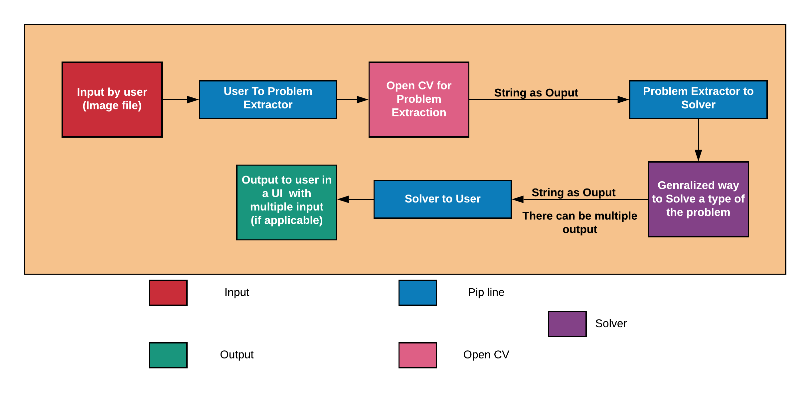
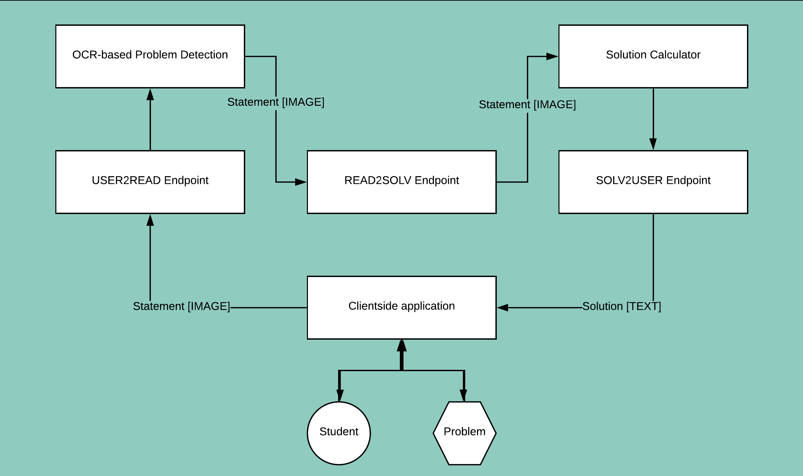
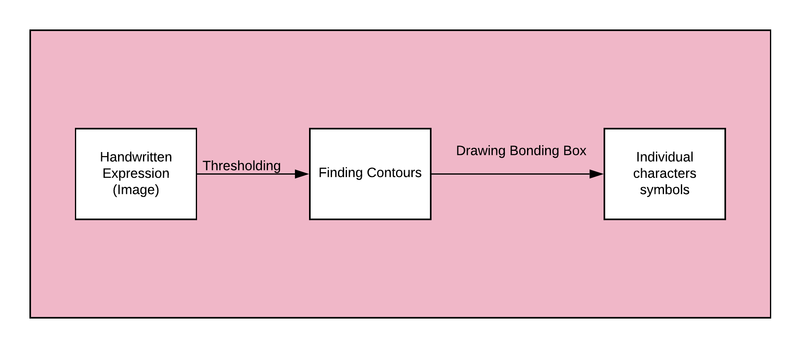
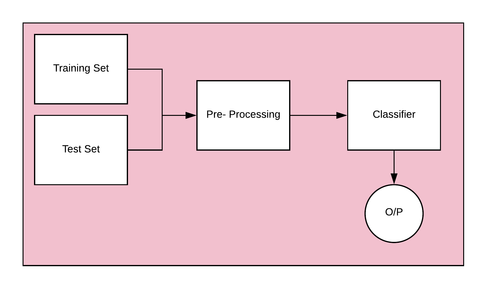
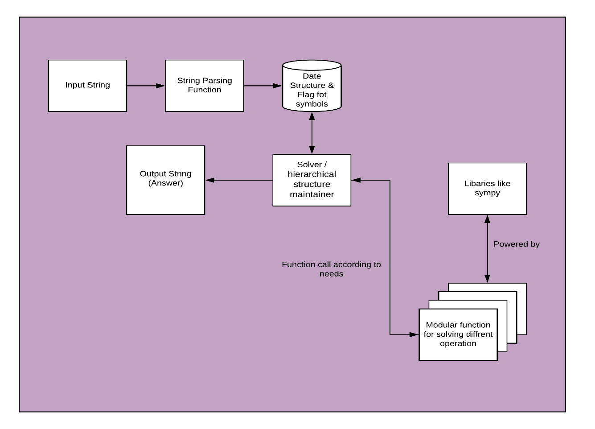

# Architecture-DOCS

PROBLEM STATEMENT 1: HANDWRITTEN MATHEMATICAL EQUATION SOLVER

Solving mathematical equation is tedious task. There are various domains in mathematics which approaches problems in different manner. In this particular application we will be building mobile phone application which will be used to scan handwritten text and get step by step

solution for various mathematical problems.

## Branches:

We have divided the project 3 parts:

- **Pipeline** handled by Akashdeep
- **Open CV / Math’s Problem extraction** handled by Mahij & Mohit
- **Solver** handled by Ankit Sinha

## Equations Currently (dated: 30/06/2020) working on:

- Basic Algebra (Till 10th standard)
- Basic math

## Libraries:

- Keras
- Opencv
- Numpy
- Django
- Requests
- Numpy
- Sympy

## Basic Flow Diagram

## Details by **Pipeline Team**

### By Akashdeep Dhar:

1. Designed three pipelines and image/data transfer
2. user2read for conveying problem image to statement detector
3. read2solv for conveying detected statement to problem solver
4. solv2user for conveying obtained solution to end user

## Details by **Problem Extractor Team**

### By Mohit & Mahij:

1. Used OpenCV contours to create bounding boxes
2. TO solve some problems in this approach
3. transfer learning

## Details by **Problem Solver Team**

### By Ankit Sinha

### Currently worked on:
- Currently we are using Python Eval function
- Parsing the input string for value extraction
- Currently saving the data/value in an array and flag is used for operator
- Have the array indexing for optimal storage and generalized equations
- Looking over library like sympy and maths for providing the solution.
- One of more important task is to make a hierarchical structure for BODMAS or equation integrity

### Have to work on
- Have to Integrate Solver Engine   
- Different type of equations solver 
- system to send a equation to correct solver 

